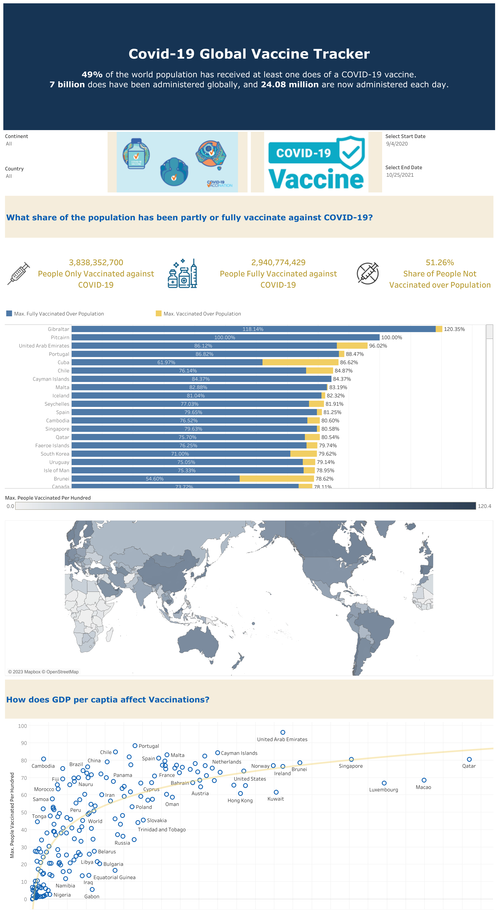

# Covid-19-Vaccine-Tracker
Created an interactive Covid-19 global vaccination tracker using Tableau, delivering real-time insights into global vaccination progress. Developed an accessible dashboard for users to explore vaccination statistics.

## Tableau Dashboard Preview

## Features

- **Real-Time Data**: The dashboard is continuously updated to provide the latest information on Covid-19 vaccination progress worldwide.

- **Interactive Visualizations**: Users can interact with various visualizations to explore vaccination trends, vaccination rates, and other relevant data.

- **Global Coverage**: The dashboard covers vaccination statistics for countries and regions around the world, allowing users to compare vaccination efforts on a global scale.

- **Accessibility**: We have designed the dashboard with user accessibility in mind, ensuring that it can be easily used by a wide range of individuals.

## How to Use

1. **Access the Dashboard**:[link-to-dashboard](https://public.tableau.com/views/Covid-19VaccinationDashboard_16948746354300/CovidVaccineTracker?:language=en-US&:display_count=n&:origin=viz_share_link)

2. **Explore the Data**: Use the interactive features within the dashboard to access detailed information about Covid-19 vaccination efforts worldwide.

3. **Customize Your View**: Tailor your view by selecting filters, adjusting parameters, and exploring different visualizations to gain valuable insights.

## Contributing

I welcome contributions to improve this project and expand its capabilities. If you have ideas for enhancements, spot any issues, or want to contribute in any way, please follow these steps:

1. **Fork this Repository**: Click the "Fork" button to create your copy of this repository.

2. **Make Changes**: Make your desired changes or improvements to the dashboard or its underlying code.

3. **Submit a Pull Request**: After making changes in your forked repository, submit a pull request to have your modifications reviewed and potentially merged into the main project.

